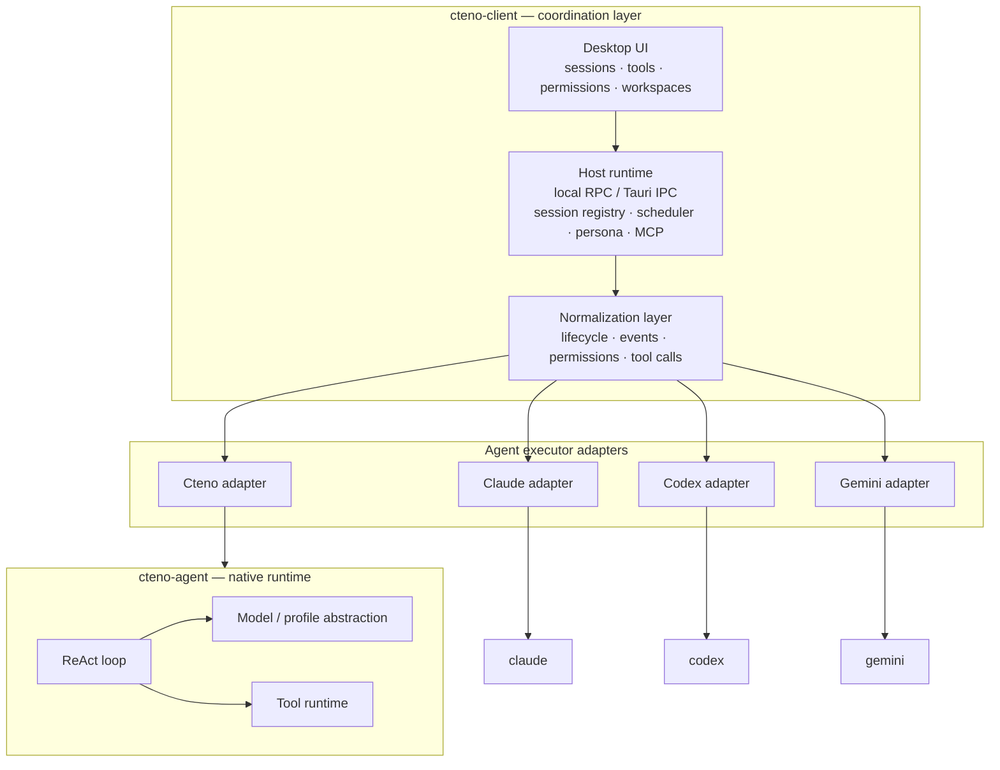

# Cteno

**English** · [中文](README.zh-CN.md)


Cteno is a desktop runtime for running and coordinating AI agents on your own machine.

It does two things that don't usually live together:

1. **cteno-agent** — a native ReAct agent runtime that talks to any model provider.
2. **cteno-client** — a desktop harness that runs Claude Code, Codex, Gemini CLI, and Cteno's own agent as peers: same workspace, same permission loop, same session model, same UI.

## Why this exists

Every coding agent today wants to own your terminal. Claude Code, Codex, Gemini CLI — each ships its own session protocol, permission flow, tool surface, and config. None of them talk to each other. You pick one and commit.

That's backwards. No single agent is strictly best at everything, and the rankings keep moving. What you actually want:

- use Claude for one task and Codex for the next, in the same repo, without rewiring anything;
- orchestrate them together — dispatch, vote, subagent delegation, scheduled runs;
- keep sessions, permissions, and data on *your* machine, not on someone's servers.

Cteno is the client that makes that real. Server-side we store zero session state — your daemon owns the SQLite, the server is a dumb socket relay between your devices.

## cteno-agent — the native runtime

`cteno-agent` is our own agent loop. Not a wrapper around one vendor's API; a model-agnostic ReAct runtime.

- pluggable model providers: OpenAI-compatible, Anthropic, Gemini, DeepSeek, proxy routes, whatever you wire in;
- streaming events for text, reasoning, tool calls, tool results, permissions, completion;
- built-in tools: shell, file read/write/edit, search, browser automation, screenshots, memory, skills, MCP;
- permission closure for anything risky;
- shipped as a stdio binary, so the host talks to it over the same shape it uses to talk to `claude` or `codex`.

We use it ourselves, and we treat it as a peer — not a preferred vendor. If the coordination layer only worked well for our own agent, the architecture would be a lie.

## cteno-client — the coordination layer

This is where the real engineering sits. Adapters are easy; *making different agents behave like peers* is not.

Every vendor differs in:

- how sessions spawn, resume, interrupt, close;
- how tool calls are framed and how results flow back;
- how permission requests are shaped and whether they block;
- how reasoning / text / tool deltas are split in the stream;
- how model, effort, and permission mode are changed mid-session.

Cteno normalizes all of that behind one executor contract and one event shape. The desktop UI, the permission modal, the session list, the workspace MCP config — they all work the same no matter which vendor is behind the session.

Once agents are peers, we give them shared ground instead of siloed state:

- **Shared chat history** — every agent's session is persisted in one place, resumable and cross-referenceable regardless of which vendor ran it;
- **Shared memory** — what one agent remembers is readable by the others;
- **Shared skills** — reusable playbooks loaded the same way for every vendor;
- **Shared MCP tools** — one config, every agent sees the same tool surface;
- **Workspace templates** — preconfigured multi-agent setups you drop onto a project and they're ready to collaborate.

On top of that comes real coordination:

- **Persona dispatch** — route a task to whichever agent fits;
- **Subagent delegation** — nested sessions, any vendor;
- **Scheduled tasks** — cron-style wakeups into any agent;
- **Workflows** — multi-agent steps, votes, handoffs.

## Design stance

A few choices we won't compromise on:

- **Local-first.** The daemon owns your data in local SQLite. The server is a relay, not a database. Cross-device access rides socket events the server never inspects.
- **Session internal / external split.** Anything inside one ReAct loop belongs to the agent process. Anything across sessions — registry, scheduling, persistence, identity — belongs to the host. Every new feature picks a side before it's written.
- **Three agents, equal citizens.** Cteno / Claude / Codex go through the same `AgentExecutor` trait. A Cteno-only bug gets fixed in the cteno-agent layer, not in the shared executor. No secret fast paths for our own runtime.
- **Hooks over reverse imports.** The agent runtime is a library. When it needs host capabilities (tools, URLs, notifications, skills), it declares a trait seam and the host installs an impl. No upward dependencies.
- **One codebase, community and commercial.** Same desktop binary, same protocols, same crypto. Hosted features gate on auth state, not on compile-time forks.

## Architecture



## Build from source

Sidecars:

```bash
cargo build --manifest-path packages/agents/rust/crates/cteno-agent-stdio/Cargo.toml
cargo build --manifest-path packages/host/rust/Cargo.toml -p cteno-host-memory-mcp
```

Community desktop:

```bash
cargo build --manifest-path apps/client/desktop/Cargo.toml \
  --no-default-features \
  --features community \
  --bin cteno
```

Run:

```bash
apps/client/desktop/target/debug/cteno
```

Local mode needs no hosted account. More build notes: [docs/community.md](docs/community.md).
