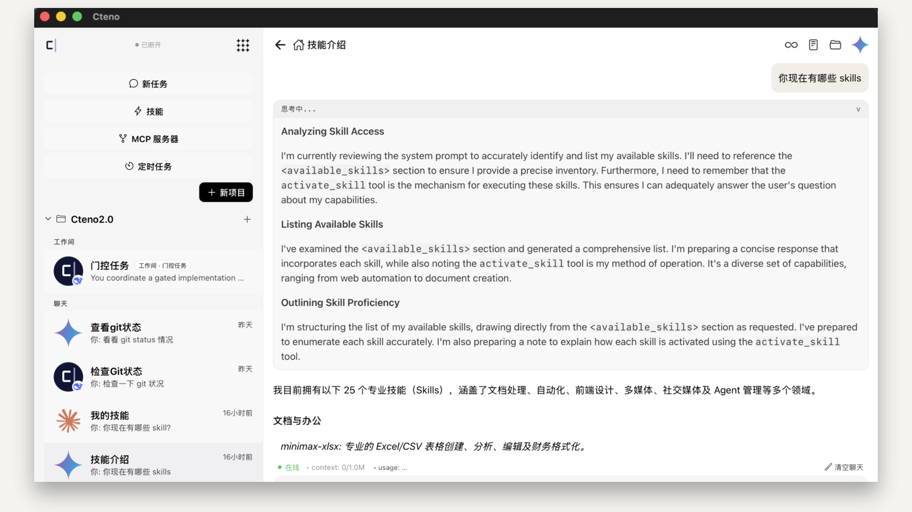
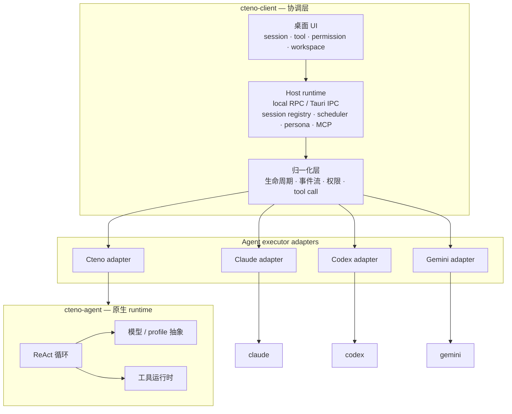

# Cteno

[English](README.md) · **中文**



Cteno 是一个跑在你自己机器上、用来运行和编排 AI agent 的桌面 runtime。

它同时做两件通常不会放在一起的事：

1. **cteno-agent** —— 我们自己的 ReAct agent runtime，对接任意模型 provider；
2. **cteno-client** —— 一个桌面 harness，把 Claude Code、Codex、Gemini CLI 和 Cteno 自己的 agent 作为对等 vendor 一起跑：同一个 workspace、同一套权限闭环、同一套 session 模型、同一个 UI。

## 为什么要有它

现在每家编程 agent 都想独占你的 terminal。Claude Code、Codex、Gemini CLI 各有各的 session 协议、权限流、工具面和配置。互相不说话。你选一家，就押在这一家。

这不对。没有哪家 agent 永远最强，排名一直在变。你真正想要的是：

- 同一个仓库里，这个任务用 Claude，下个任务用 Codex，不用来回重配；
- 让它们一起干活 —— 派发、投票、子 agent 委派、定时唤醒；
- session、权限、数据都留在**你自己的机器上**，而不是交给某家 SaaS。

Cteno 就是让这些成立的客户端。服务端不存任何 session 内容 —— 你的 daemon 拥有本地 SQLite，服务器只做跨设备的 socket relay，不检查内容。

## cteno-agent —— 原生 agent runtime

`cteno-agent` 是我们自己的 agent loop。不是某家厂商 API 的外壳，是一个模型无关的 ReAct runtime。

- 可插拔模型 provider：OpenAI-compatible、Anthropic、Gemini、DeepSeek、proxy 路由等；
- 流式事件：文本、reasoning、tool call、tool result、权限、完成；
- 内建工具：shell、文件读写编辑、搜索、浏览器自动化、截图、memory、skills、MCP；
- 高风险动作的权限闭环；
- 打包成 stdio 二进制 —— 宿主调它和调 `claude` / `codex` 走同一套协议。

我们自己在用，而且把它当作**对等 vendor**，不是偏爱的自家产品。协调层如果只有自家 agent 跑得好，那架构就是假的。

## cteno-client —— 协调层

真正的工程量在这。Adapter 本身不难，**让不同 agent 以对等身份运转**才是难的。

每家 vendor 在下面这些地方都不一样：

- session 怎么创建、恢复、中断、关闭；
- tool call 怎么组装，结果怎么回流；
- 权限请求的形状、是否阻塞；
- reasoning / text / tool delta 的流式怎么切分；
- session 中途怎么切模型、切 effort、切 permission mode。

Cteno 把这些全部归一化到一个 executor contract 和一套事件形状之后，桌面 UI、权限 Modal、session 列表、workspace MCP 配置 —— 不管背后是哪家 vendor，用起来都一样。

agent 真正对等之后，我们再给它们一块共同的地基，而不是让每家各自维护一套孤岛：

- **共享聊天记录** —— 所有 agent 的 session 统一持久化，不管是哪家 vendor 跑的，都能恢复、互相引用；
- **共享 memory** —— 一个 agent 记住的事，其他 agent 也能读到；
- **共享 skill** —— 可复用的工作流，对所有 vendor 用同一种方式加载；
- **共享 MCP 工具** —— 一份配置，每家 agent 看到同一套工具面；
- **工作间模板** —— 预配置好的多 agent 协作方案，套到项目上就能直接开工。

在这之上才是真正的编排：

- **Persona 派发** —— 按任务路由到合适的 agent；
- **Subagent 委派** —— 嵌套 session，任意 vendor；
- **定时任务** —— cron 风格的唤醒，派到任何 agent；
- **Workflow** —— 多 agent 步骤、投票、交接。

## 设计立场

有几条不妥协的：

- **Local-first**。Daemon 拥有你的数据，存在本地 SQLite。服务器是 relay，不是数据库。跨设备访问走服务器不 inspect 的 socket 事件。
- **Session 内 / Session 外分离**。一个 ReAct 循环里发生的事归 agent 进程；跨 session 的事（注册、调度、持久化、身份）归宿主。每个新功能先站队再动手。
- **三家 agent 对等**。Cteno / Claude / Codex 走同一个 `AgentExecutor` trait。Cteno-only 的 bug 修在 cteno-agent 层，不修在共用 executor。不给自家 runtime 开后门。
- **Hook 优先，不反向依赖**。Agent runtime 是 library。需要宿主能力时声明 trait seam，宿主装 impl 进去。不往上 import。
- **Community 与 Commercial 同一份代码**。同一个桌面二进制、同一套协议、同一套加密。云端能力按登录态启用，不做编译期分叉。

## 架构



## 从源码构建

Sidecar：

```bash
cargo build --manifest-path packages/agents/rust/crates/cteno-agent-stdio/Cargo.toml
cargo build --manifest-path packages/host/rust/Cargo.toml -p cteno-host-memory-mcp
```

社区版桌面：

```bash
cargo build --manifest-path apps/client/desktop/Cargo.toml \
  --no-default-features \
  --features community \
  --bin cteno
```

启动：

```bash
apps/client/desktop/target/debug/cteno
```

本地模式不需要登录任何托管账号。更多构建说明：[docs/community.md](docs/community.md)。
